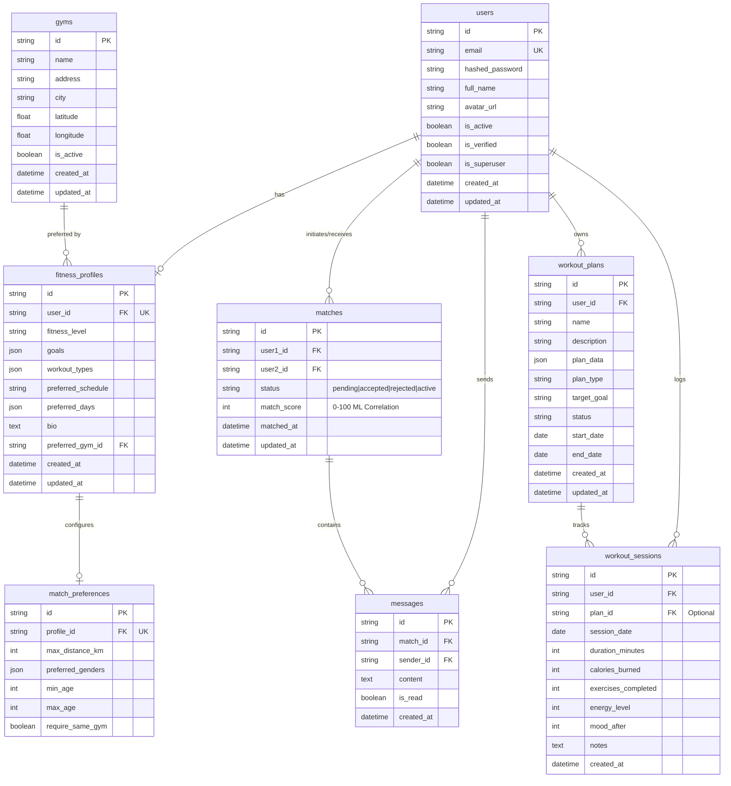

# GymBuddy - Complete ER Diagram (v2)

This diagram outlines the complete database schema architecture encompassing Phase 1 through Phase 6 features including ML collaborative filtering matches, chat messaging, gym locations, and AI generated workout plans.

## Entity Relationship Diagram

## Description of Mappings

1. **Authentication Core:** `users` is the primary table. Upon registration, users get an entry. Secondary onboarding triggers the creation of `fitness_profiles` and `match_preferences` which act in a `1:1` relationship linking `user_id`.
2. **Geographical Features:** Physical `gyms` have a `1:N` relationship with User Profiles. Many users can set the same gym as their `preferred_gym_id`.
3. **Connections:** The ML matching engine calculates similarity and instantiates a `matches` table connecting `user1_id` and `user2_id`.
4. **Real-time Chat:** If a match achieves `active` status, WebSockets allow real-time creation of `messages` scoped to exactly one `match_id`.
5. **Workout Tracking:** The AI generates `workout_plans` which persist for 4-weeks. `workout_sessions` acts as an event log table tracking daily checks correlating to the overarching plan via `plan_id`.

## Indexes (Optimized for Query Performance)
- `users.email` - Unique index for JWT Auth login parsing.
- `fitness_profiles.user_id` - Fast indexed joins.
- `gyms.city`, `gyms.name` - Used in `/gyms` query parameters.
- `matches.user1_id`, `matches.user2_id` - Finding active chats.
- `messages.match_id` - Aggressive ordering and WebSocket bulk fetch.
